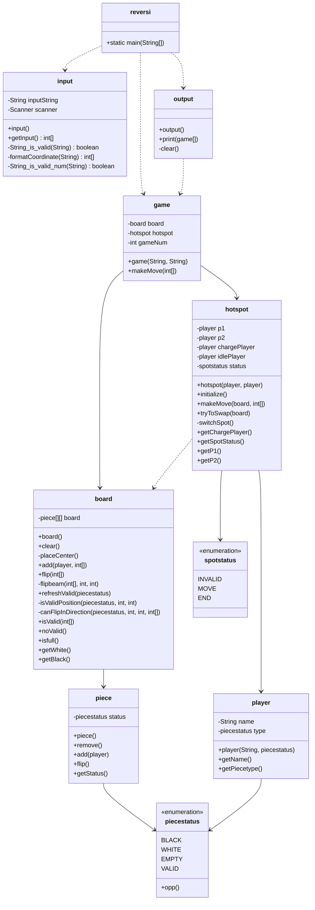

# REVERSI 3/4 进度记录

## 文档结构

    .
    ├── README.md
    ├── bin
    │   ├── board.class
    │   ├── game.class
    │   ├── hotspot.class
    │   ├── input.class
    │   ├── output$1.class
    │   ├── output.class
    │   ├── piece.class
    │   ├── piecestatus.class
    │   ├── player.class
    │   ├── reversi.class
    │   ├── reversi.jar
    │   └── spotstatus.class
    ├── oldfiles
    │   ├── README_oldversion1.0.md
    │   ├── pic_v1
    │   │   ├── screenshot1.png
    │   │   ├── screenshot2.png
    │   │   ├── screenshot3.png
    │   │   ├── screenshot4.png
    │   │   ├── screenshot5.png
    │   │   └── screenshot6.png
    │   └── pic_v2
    │       ├── screenshot1.png
    │       ├── screenshot2.png
    │       └── screenshot3.png
    ├── pic
    │   ├── screenshot1.png
    │   ├── screenshot2.png
    │   ├── screenshot3.png
    │   └── screenshot4.png
    └── src
        ├── board.java
        ├── game.java
        ├── hotspot.java
        ├── input.java
        ├── output.java
        ├── piece.java
        ├── piecestatus.java
        ├── player.java
        ├── reversi.java
        └── spotstatus.java
    
    7 directories, 37 files

---

## 类的功能分解

    board：棋盘类
        - 维护 8x8 的棋盘状态
        - 处理棋子的放置和翻转
        - 计算每个位置的有效性
        - 提供棋盘状态查询功能

    piece：棋子类
        - 维护棋子状态（黑/白/空/可落子）
        - 提供翻转功能
        - 统计黑白棋子数量

    piecetype：棋子类型枚举
        - 定义棋子的四种状态：BLACK/WHITE/EMPTY/VALID
        - 提供获取对手棋子类型的方法(opp)

    player：玩家类
        - 存储玩家信息（名字、执子颜色）
        - 管理玩家状态

    input：输入处理类
        - 处理用户输入（A1-H8，a1-h8格式）
        - 验证输入合法性
        - 转换输入为程序可用的坐标

    output：显示类
        - 打印棋盘当前状态
        - 显示玩家信息和回合信息
        - 提供清屏功能
        - 显示游戏结果
        - 不保存状态，每次显示时通过参数获取最新信息

    hotspot：游戏控制，"热座"用于操作
        - 管理游戏进程
        - 处理玩家轮换
        - 判断游戏结束条件

    spotstatus：游戏状态枚举
        - 定义游戏状态：INVALID（非法移动）/MOVE（正常移动）/END（游戏结束）
        - 用于控制游戏流程

    game：游戏类
        - 管理单个游戏实例
        - 包含棋盘和游戏状态
        - 处理游戏逻辑和状态转换
        - 提供游戏操作接口

---

## 编译运行命令

### 编译

在 src 目录下执行：

    javac -d ../bin *.java

### 打包

在 bin 目录下执行：

    jar -e reversi -c -f reversi.jar *.class

### 运行

在 bin 目录下执行：

    java -jar reversi.jar

---

## UML类图

### 类图关系说明

    实线箭头（-->）：表示组合关系（Composition）
        - 表示强依赖，整体与部分的关系
        - 例如：board --> piece 表示棋盘包含多个棋子
        - 部分不能脱离整体而存在
        - 如：output 包含对 board、hotspot、player 的引用

    虚线箭头（..>）：表示依赖关系（Dependency）
        - 表示一个类使用另一个类的功能
        - 例如：hotspot ..> board 表示游戏控制类会调用棋盘的方法
        - 是一种较弱的关系，仅在运行时交互
        - 如：reversi 主类依赖其他类来实现功能

## 运行截图

### 初始化,x提示可以落子的位置

### 黑棋进行落子

### 白棋进行落子

### 切换棋盘

## P. S.

重写中使用了llm辅助，生成了一些函数和注释。readme文档中类的关系说明，uml图由llm生成  
编辑调试于macos，不确定clear操作在win平台是否可行
