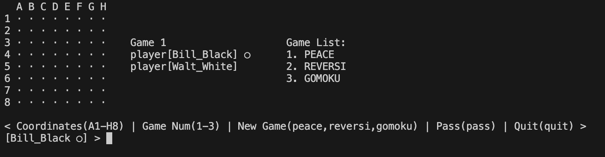
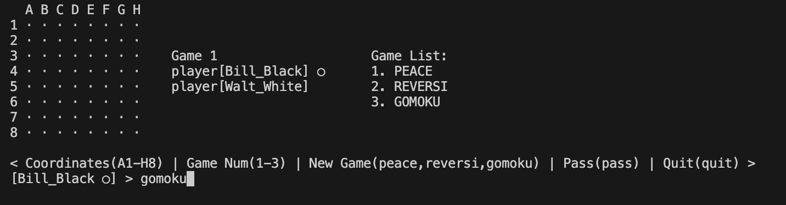
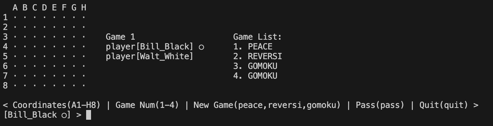
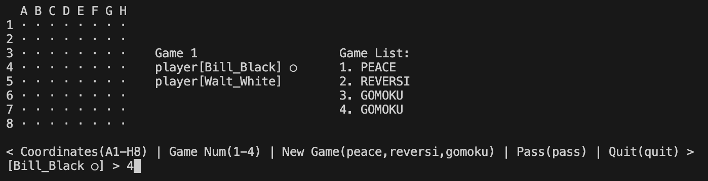
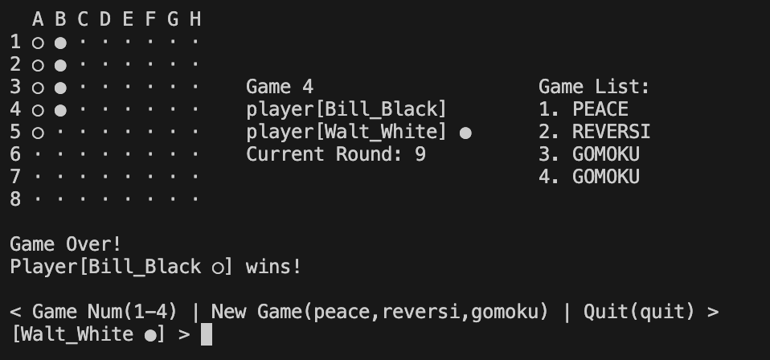
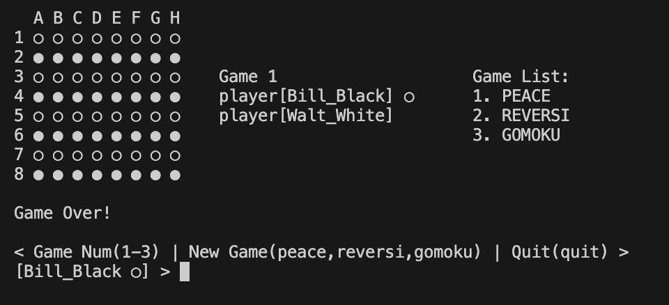

# REVERSI 4/7 进度记录

## 运行命令

    #reversi目录下

        java -jar reversi.jar
        
## 文档结构

```shell
./src
└── reversi
    ├── Reversi.java
    ├── core
    │   ├── games
    │   │   ├── GameManager.java
    │   │   └── game
    │   │       ├── Game.java
    │   │       ├── GameMode.java
    │   │       ├── board
    │   │       │   ├── Board.java
    │   │       │   ├── Piece.java
    │   │       │   ├── PieceStatus.java
    │   │       │   └── types
    │   │       │       ├── GomokuBoard.java
    │   │       │       ├── PeaceBoard.java
    │   │       │       └── ReversiBoard.java
    │   │       └── spot
    │   │           ├── HotSpot.java
    │   │           └── Player.java
    │   └── logic
    │       ├── GameLogic.java
    │       └── exceptions
    │           ├── GameErrorCode.java
    │           └── GameException.java
    ├── model
    │   ├── input
    │   │   ├── InputInformation.java
    │   │   ├── InputInformationFactory.java
    │   │   ├── InputType.java
    │   │   └── types
    │   │       ├── InvalidInformation.java
    │   │       ├── MoveInformation.java
    │   │       ├── NewGameInformation.java
    │   │       ├── PassInformation.java
    │   │       ├── QuitInformation.java
    │   │       └── SwitchBoardInformation.java
    │   └── output
    │       ├── OutputInfomationFactory.java
    │       ├── OutputInformation.java
    │       ├── OutputType.java
    │       └── components
    │           ├── BoardInfo.java
    │           └── GameInfo.java
    └── ui
        └── console
            ├── Input.java
            └── Output.java
```

---

## 类的功能分解

### core 包 - 核心游戏逻辑

1. `games` 子包
   - 游戏实例管理
   - gameManager管理game，game管理board和hotSpot，board管理棋子，hotSpot管理player和游戏进程
   - 本次新添加的游戏模式作为board的一个子类
   - 不同游戏的结束逻辑通过多态实现，board将其抽象为统一格式
   - 每个game实例在调用update时，都会先进行检查，如果游戏已经结束，则直接返回，这个game实例的状态以此锁死，update到over则触发这个锁死

2. `logic` 子包
   - 游戏主循环控制
   - 游戏状态管理
   - 错误处理
   - gameLogic管理gameManager 对inputInformation做拆包，调用ui包的Input和Output类进行输入输出
   - hotspot开始向外抛出错误，gameLogic捕获错误，并调用ui包的Output类进行输出

### model 包 - 数据模型

1. `input` 子包
   - 输入信息封装
   - 输入类型定义
   - 输入验证
   - 包含：`InputInformation`, `InputType` 等类
   - InputInformation改写为接口，通过以下类实现：`NewGameInformation`, `MoveInformation`, `PassInformation`, `SwitchBoardInformation`, `QuitInformation`

2. `output` 子包
   - 输出信息封装
   - 输出类型定义
   - 为解决这个类过大的问题，将该类拆封为两个小类，返回各自包含的信息
   - 包含：`OutputInformation`, `OutputType` 等类

### ui 包 - 用户界面

1. `console` 子包
   - 控制台输入处理
   - 控制台输出格式化
   - 包含：`Input`, `Output` 等静态工具类，仅在 gameloop() 中使用

## 运行截图

仅展示新功能

### 初始化



### 新建gomoku





### 切换到棋盘四




### 黑胜(纵向)，回合数正确



### 黑胜(斜向)


### 平局


### peace game信息不同


