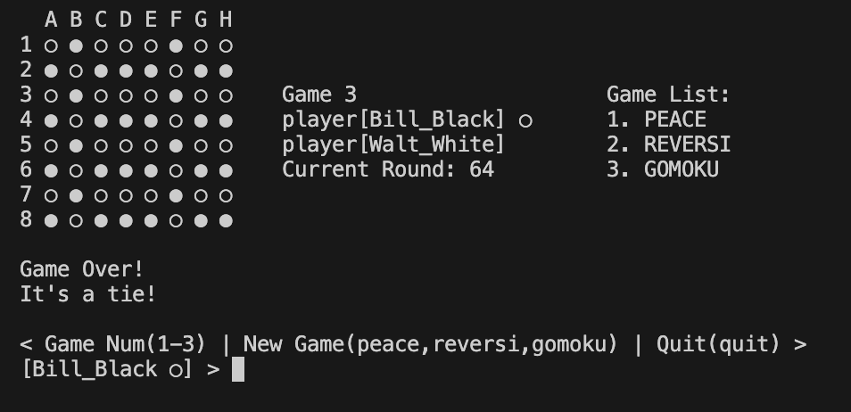

# REVERSI 3/4 进度记录

## 运行命令

    java -jar ./reversi.jar

## 文档结构

        
    .
    ├── README.md
    ├── README.pdf
    ├── bin
    │   ├── MANIFEST.MF
    │   └── reversi
    │       ├── core
    │       │   └── game
    │       │       ├── board
    │       │       │   ├── board.class
    │       │       │   ├── piece.class
    │       │       │   └── piecestatus.class
    │       │       ├── game.class
    │       │       ├── spot
    │       │       │   ├── hotspot.class
    │       │       │   └── player.class
    │       │       └── spotstatus.class
    │       ├── reversi.class
    │       └── ui
    │           └── console
    │               ├── input.class
    │               ├── output$1.class
    │               └── output.class
    ├── pic
    │   ├── screenshot1.png
    │   ├── screenshot2.png
    │   ├── screenshot3.png
    │   └── screenshot4.png
    ├── reversi.jar
    └── src
        └── reversi
            ├── core
            │   └── game
            │       ├── board
            │       │   ├── board.java
            │       │   ├── piece.java
            │       │   └── piecestatus.java
            │       ├── game.java
            │       ├── spot
            │       │   ├── hotspot.java
            │       │   └── player.java
            │       └── spotstatus.java
            ├── reversi.java
            └── ui
                └── console
                    ├── input.java
                    └── output.java
    
    18 directories, 29 files

---

## 类的功能分解

### 核心游戏逻辑 (Core Game Logic)
1. `game` 类：游戏主控制器
    - 管理单个游戏实例
    - 协调棋盘和玩家操作
    - 提供游戏状态查询接口
    - 处理游戏进程控制

2. `hotspot` 类：回合控制器
    - 实现"热座"模式的玩家轮换机制
    - 管理当前行动玩家和等待玩家
    - 处理玩家移动验证
    - 控制游戏状态转换

3. `spotstatus` 枚举：游戏状态
    - `MOVE`：等待正常移动
    - `INVALID`：上一步移动非法
    - `END`：游戏结束

### 棋盘管理 (Board Management)
1. `board` 类：棋盘控制器
    - 维护 8x8 棋盘状态
    - 处理棋子放置和翻转逻辑
    - 计算有效移动位置
    - 提供棋盘状态查询
    - 统计黑白棋子数量

2. `piece` 类：棋子实体
    - 维护单个棋子状态
    - 提供状态转换方法
    - 实现棋子翻转逻辑

3. `piecestatus` 枚举：棋子状态
    - `BLACK`：黑棋
    - `WHITE`：白棋
    - `EMPTY`：空位
    - `VALID`：可落子位置

### 玩家管理 (Player Management)
1. `player` 类：玩家实体
    - 存储玩家基本信息（名字）
    - 管理玩家执子颜色
    - 提供玩家信息查询接口

### 用户界面 (User Interface)
1. `input` 类：输入控制器
    - 处理用户输入（A1-H8 格式）
    - 验证输入合法性
    - 转换坐标格式
    - 支持游戏切换指令

2. `output` 类：显示控制器
    - 渲染棋盘状态
    - 显示玩家信息
    - 提供游戏状态反馈
    - 实现跨平台清屏功能

## 运行截图

### 初始化,x提示可以落子的位置

### 黑棋进行落子

### 白棋进行落子

### 切换棋盘

## P. S.

重写中使用了llm辅助，生成了一些函数和注释。readme文档中类的关系说明，uml图由llm生成  
