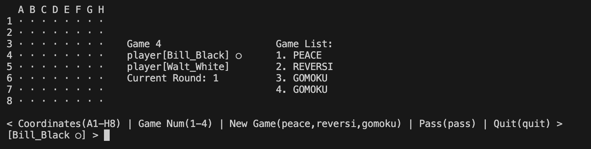

# REVERSI 3/24 进度记录

## 运行命令

    #reversi目录下

        java -jar reversi.jar
        
## 文档结构

    ./src
    └── reversi
        ├── Reversi.java
        ├── core
        │   ├── games
        │   │   ├── GameManager.java
        │   │   └── game
        │   │       ├── Game.java
        │   │       ├── GameMode.java
        │   │       ├── board
        │   │       │   ├── Board.java
        │   │       │   ├── PeaceBoard.java
        │   │       │   ├── Piece.java
        │   │       │   ├── PieceStatus.java
        │   │       │   └── ReversiBoard.java
        │   │       └── spot
        │   │           ├── HotSpot.java
        │   │           ├── Player.java
        │   │           └── SpotStatus.java
        │   └── logic
        │       ├── GameLogic.java
        │       └── exceptions
        │           ├── GameErrorCode.java
        │           └── GameException.java
        ├── model
        │   ├── input
        │   │   ├── InputInformation.java
        │   │   ├── InputType.java
        │   │   └── types
        │   │       ├── InvalidInformation.java
        │   │       ├── MoveInformation.java
        │   │       ├── NewGameInformation.java
        │   │       ├── PassInformation.java
        │   │       ├── QuitInformation.java
        │   │       └── SwitchBoardInformation.java
        │   └── output
        │       ├── OutputInformation.java
        │       └── OutputType.java
        └── ui
            └── console
                ├── Input.java
                └── Output.java

    15 directories, 27 files

---

## 类的功能分解

### core 包 - 核心游戏逻辑

1. `games` 子包
   - 游戏实例管理
   - gameManager管理game，game管理board和hotSpot，board管理棋子，hotSpot管理player和游戏进程

2. `logic` 子包
   - 游戏主循环控制
   - 游戏状态管理
   - 错误处理
   - gameLogic管理gameManager 对inputInformation做拆包，构造outputInformation，并调用ui包的Input和Output类进行输入输出
   - hotspot开始向外抛出错误，gameLogic捕获错误，并调用ui包的Output类进行输出

### model 包 - 数据模型

1. `input` 子包
   - 输入信息封装
   - 输入类型定义
   - 输入验证
   - 包含：`InputInformation`, `InputType` 等类
   - InputInformation由多态实现，具体实现类有：`NewGameInformation`, `MoveInformation`, `PassInformation`, `SwitchBoardInformation`, `QuitInformation`

2. `output` 子包
   - 输出信息封装
   - 输出类型定义
   - 包含：`OutputInformation`, `OutputType` 等类

### ui 包 - 用户界面

1. `console` 子包
   - 控制台输入处理
   - 控制台输出格式化
   - 包含：`Input`, `Output` 等静态工具类，仅在 gameloop() 中使用

## 运行截图

### 游戏开始界面，黑方进行落子

### 游戏进行，白方进行落子

### 黑方切换到棋盘二

### 棋盘二的初始布局有所调整，便于测试，release版还是中央四个

### 黑方落子后白方无棋可走，提示should pass

### 黑方落子到A3

### 游戏结束，结算信息，黑方创建新棋盘reversi

### 创建后gamelist刷新，保留在game2

### 切换到game3，测试切换不存在的棋盘，非法pass，无效输入，冲突落子，退出

