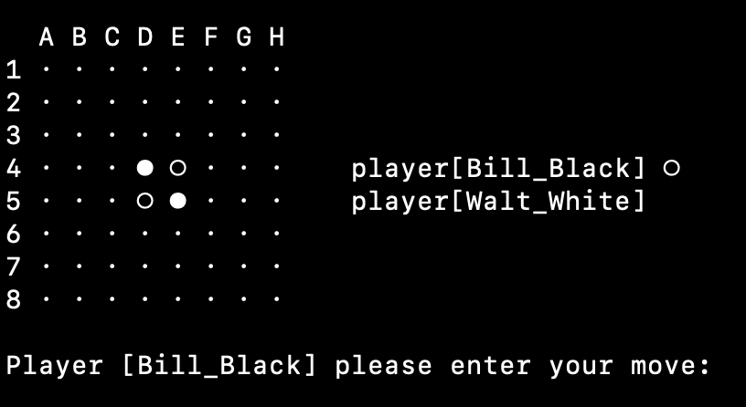
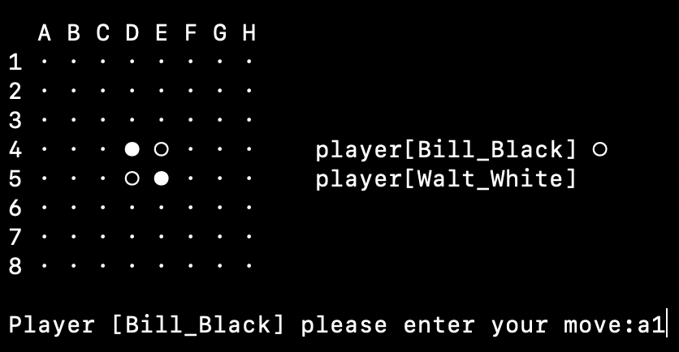
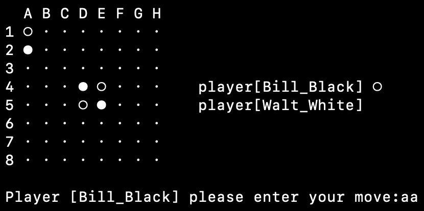
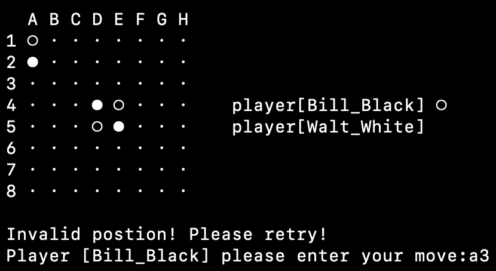
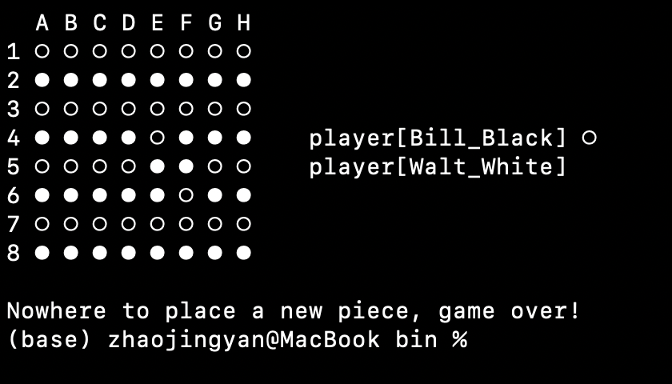

# REVERSI Week2 Lab

this should be a development info

## 文档结构

    .
    ├── README.md
    ├── bin
    │   ├── board.class
    │   ├── gamelogic.class
    │   ├── input.class
    │   ├── output$1.class
    │   ├── output.class
    │   ├── piece.class
    │   ├── pieceStatus.class
    │   ├── player.class
    │   ├── playerStatus.class
    │   ├── reversi.class
    │   └── reversi.jar
    ├── pic
    │   ├── screenshot1.png
    │   ├── screenshot2.png
    │   ├── screenshot3.png
    │   ├── screenshot4.png
    │   ├── screenshot5.png
    │   └── screenshot6.png
    └── src
        ├── board.java
        ├── gamelogic.java
        ├── input.java
        ├── output.java
        ├── piece.java
        ├── pieceStatus.java
        ├── player.java
        ├── playerStatus.java
        └── reversi.java
    
    4 directories, 27 files
---

## 功能分解

    board : 棋盘类，维护棋盘信息，轮数，用一个boolean[][]记录可落子的位置  
    gamelogic : 将游戏逻辑抽象为一个实体看待，可能有一些面向过程的“嫌疑”，后续可能需要重写  
    input : 封装所有的用户交互，检验输入的合法性，起类似于前端的作用  
    output : 封装所有的输出函数，将输出抽象为一个整体  
    piece : 棋子类，有黑白空三种状态  
    pieceStatus : enum棋子状态
    player : 将玩家看为实体，记录名字，先后手，状态(idle,move,invalid)  
    reversi : Main class
    设计细节请参见源代码和注释
    p.s. input,output类之后可能由图形界面替换，应设计为与其他部分低耦合
---

## 编译运行命令

### 编译出所有.class文件

```bash
# ./src
javac -d ../bin *.java  
```

### bin目录下打包为reversi.jar

```bash
# ./bin
jar -e reversi -c -f reversi.jar *.class  
```

### 运行

```bash
# ./bin
java -jar reversi.jar  
```

---

## 运行截图

### 初始化



### 黑棋进行落子



### 白棋进行落子


### 黑棋进行错误落子



### 响应错误落子



### 棋盘满，游戏结束



## 阶段问题

    如何准确的进行类设计？不做无谓分离，也不过度耦合？
    代码的可延展性，可拓展性如何保障？

## 版本

v1.0  
2025.02.27  
24302010013 赵敬彦  
第一次书写README.md,必然存在不少问题，望读者谅解  
