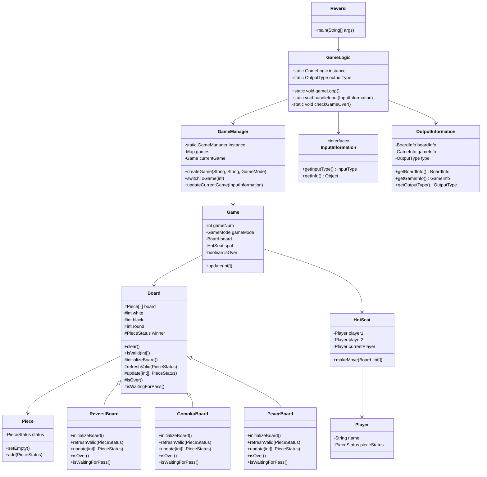

# Reversi代码分析文档

## 1. 项目结构

### 1.1 目录结构
```
.
└── reversi
    ├── core
    │   ├── games
    │   │   ├── game
    │   │   │   ├── board
    │   │   │   │   ├── Board.java
    │   │   │   │   ├── Piece.java
    │   │   │   │   ├── PieceStatus.java
    │   │   │   │   └── types
    │   │   │   │       ├── GomokuBoard.java
    │   │   │   │       ├── PeaceBoard.java
    │   │   │   │       └── ReversiBoard.java
    │   │   │   ├── Game.java
    │   │   │   ├── GameMode.java
    │   │   │   └── spot
    │   │   │       ├── HotSeat.java
    │   │   │       └── Player.java
    │   │   └── GameManager.java
    │   └── logic
    │       ├── exceptions
    │       │   ├── GameErrorCode.java
    │       │   └── GameException.java
    │       └── GameLogic.java
    ├── model
    │   ├── input
    │   │   ├── InputInformation.java
    │   │   ├── InputInformationFactory.java
    │   │   ├── InputType.java
    │   │   └── types
    │   │       ├── InvalidInformation.java
    │   │       ├── MoveInformation.java
    │   │       ├── NewGameInformation.java
    │   │       ├── PassInformation.java
    │   │       ├── QuitInformation.java
    │   │       └── SwitchBoardInformation.java
    │   └── output
    │       ├── components
    │       │   ├── BoardInfo.java
    │       │   └── GameInfo.java
    │       ├── OutputInfomationFactory.java
    │       ├── OutputInformation.java
    │       └── OutputType.java
    ├── Reversi.java
    └── ui
        └── console
            ├── Input.java
            └── Output.java
```

### 1.2 核心类关系图



## 2. 设计模式分析

### 2.1 单例模式
- 应用场景：GameLogic、GameManager
- 优点：确保全局唯一实例，便于状态管理
- 缺点：可能增加测试难度，降低代码灵活性

### 2.2 工厂模式
- 应用场景：OutputInfomationFactory
- 优点：封装对象创建逻辑，便于扩展
- 缺点：对于简单输出可能过于复杂

### 2.3 MVC架构
- 模型（Model）：处理游戏数据和状态
- 视图（View）：控制台界面实现
- 控制器（Controller）：GameLogic作为主要控制器

## 3. 代码优点

### 3.1 模块化设计
- 清晰的职责分离
- 各模块之间耦合度低
- 便于团队协作开发

### 3.2 可扩展性
- 输入输出接口分离
- 游戏模式可扩展
- 工厂模式支持新功能添加

### 3.3 异常处理
- 自定义异常体系
- 统一的错误处理机制
- 清晰的错误提示

细节分析：
1. 继承自board的子类实际上使用一套规则维护一个棋盘，这样不论对于哪一套规则的board，hotseat都只要通过统一的调用update来进行游戏，这样的多态是合理设计，自上而下看有统一的操作“接口”，而引入新游戏只需要书写新的符合规格的xxxxboard.java并修改newgameinformation的枚举，代码有非常好的可扩展性。
```java
    /**
     * 初始化棋盘
     * 由子类实现具体的初始化逻辑
     */
    protected abstract void initializeBoard();

    /**
     * 刷新有效位置
     * @param type 当前玩家执黑/白
     */
    public abstract void refreshValid(PieceStatus type);

    /**
     * 更新棋盘状态
     * @param move 移动位置
     * @param type 棋子类型
     */
    public abstract void update(int[] move, PieceStatus type);

    /**
     * 检查游戏是否结束
     * @return 是否结束
     */
    public abstract boolean isOver();

    /**
     * 检查是否需要跳过回合
     * @return 是否需要跳过
     */
    public abstract boolean isWaitingForPass();
```
2. game是类的组合，其中包含一个操作器（hotseat）的有效抽象，使得player和board的职责更加简单，而一个game的生命周期从创建到isover被锁死再也不能update，较为清晰。又采用gamemanager管理game实例，每个game实例的状态可以很好的维持。
```java
public class Game {
    // 游戏信息
    private final int gameNum;      // 游戏编号
    private final GameMode gameMode;  // 游戏模式
    private final Board board;      // 棋盘
    private final HotSeat spot;     // 玩家管理器
    private boolean isOver;         // 游戏是否结束
    ···
}
```
3. 分离化的设计，即input创建一个information实例，core分析information，做出响应；然后core创建一个outputinformation，给到output类去渲染，这样成功的把输入输出和input，output的ui分离。引入GUI只需要改动ui中的两个类，提供一种方法构造inputinformation，提供一种方法渲染outputinformation。
```java
    public static void gameLoop() {
        Output.print(OutputInfomationFactory.create(outputType, GameManager.getInstance()));
        while (logicShouldContinue()) {
            try {
                handleInput(Input.getInput());//Input的全局调用点
                checkGameOver();
                Output.print(OutputInfomationFactory.create(outputType, GameManager.getInstance()));//output的print唯一调用点
            } catch (GameException e) { //handle error
                outputType = OutputType.INVALID_INPUT;
                Output.printError(e, OutputInfomationFactory.create(outputType, GameManager.getInstance()));//output的printerr唯一调用点
            }
        }
    }

```
4. 通过自建gameexception类，将invalidinput从语法上，逻辑上的种种可能错误借助java提供的单独err通道返回，并让output类提示对应的错误类型，开发中可以分别关注不同的错误类型。
```java
public class GameException extends Exception {
    private final GameErrorCode code;  // 错误代码

    /**
     * 构造函数
     * @param code 错误代码
     * @param message 错误信息
     */
    public GameException(GameErrorCode code, String message) {
        super(message);
        this.code = code;
    }

    /**
     * 获取错误代码
     * @return 错误代码
     */
    public GameErrorCode getCode() {
        return code;
    }
}
```
几个抛出例子
抛出起点
```java
    public void makeMove(Board board, int[] coordinate) throws GameException {
        // 检查是否是跳过操作
        if (coordinate[0] == -1 && coordinate[1] == -1) {
            if (board.isWaitingForPass()) {
                changeSpot(board);
                return;
            }
            throw new GameException(GameErrorCode.MAY_NOT_PASS,
                    "Cannot pass when there are valid moves");
        }

        // 检查落子位置是否有效
        if (!board.isValid(coordinate)) {
            if (board.getPieceStatus(coordinate) == PieceStatus.WHITE
             || board.getPieceStatus(coordinate) == PieceStatus.BLACK) {
                throw new GameException(GameErrorCode.CONFLICTING_MOVE,
                        "Conflicting move! [" + (char) ('A' + coordinate[1]) + (coordinate[0] + 1)
                        + "] is already occupied");
            }
            throw new GameException(GameErrorCode.ILLEGAL_MOVE,
                    "Invalid move! [" + (char) ('A' + coordinate[1]) + (coordinate[0] + 1)
                    + "] is not a valid position");
        }

        // 正常落子的逻辑，简单直接，排除了所有可能的问题
        board.update(coordinate, chargePlayer.getPiecetype());
        changeSpot(board);
    }
```
后续catch/throw new
```java
    public void update(int[] coordinate) throws GameException {
        if (isOver) //在这一层级会发生的错误，throw完便终止
            throw new GameException(GameErrorCode.GAME_ALREADY_OVER, "This game is already over!");
        try {
            spot.makeMove(board, coordinate);
            isOver = board.isOver();  // 同步Board的结束状态
        } catch (GameException e) { //catch之前可能发生的错误
            throw e;
        }
    }
```


## 4. 存在的问题

1. 过度设计，但考虑到代码的可拓展性，可能也非问题（？）
2. 测试有难度，虽然开发过程中没有遇到很大的bug或者问题

## 5. 改进建议

### 5.1 代码优化
1. 简化设计模式使用
2. 提取配置参数到配置文件
3. 优化状态管理机制

### 5.2 可测试性提升
1. 使用依赖注入替代部分单例
2. 增加接口抽象
3. 添加单元测试

### 5.3 文档完善
1. 添加详细注释
2. 补充UML图
3. 编写使用说明

## 6. 总结

该黑白棋游戏项目整体架构设计良好，采用了多种设计模式确保代码的可维护性和可扩展性。但在某些方面存在过度设计的问题，建议根据实际需求进行适当简化。同时，建议加强测试覆盖率和文档完善，以提高代码质量。
